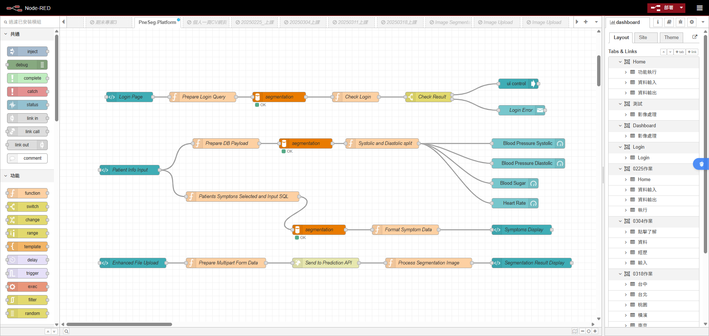
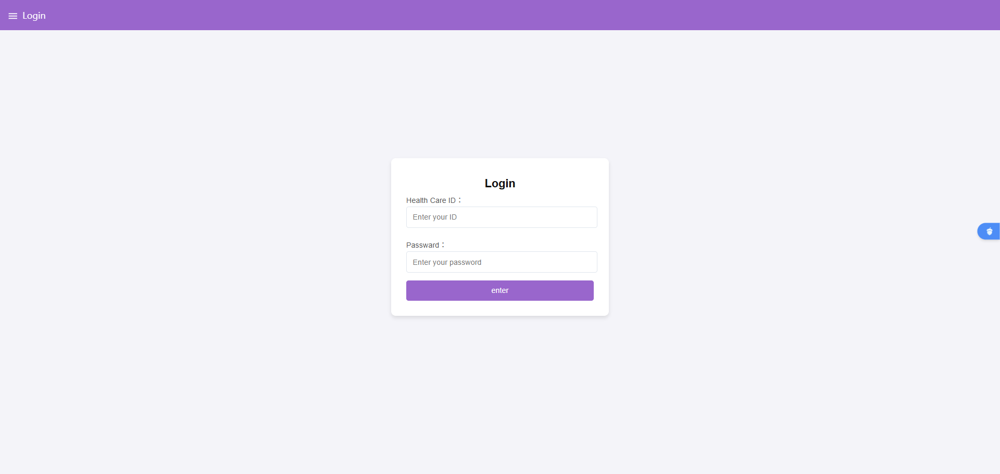
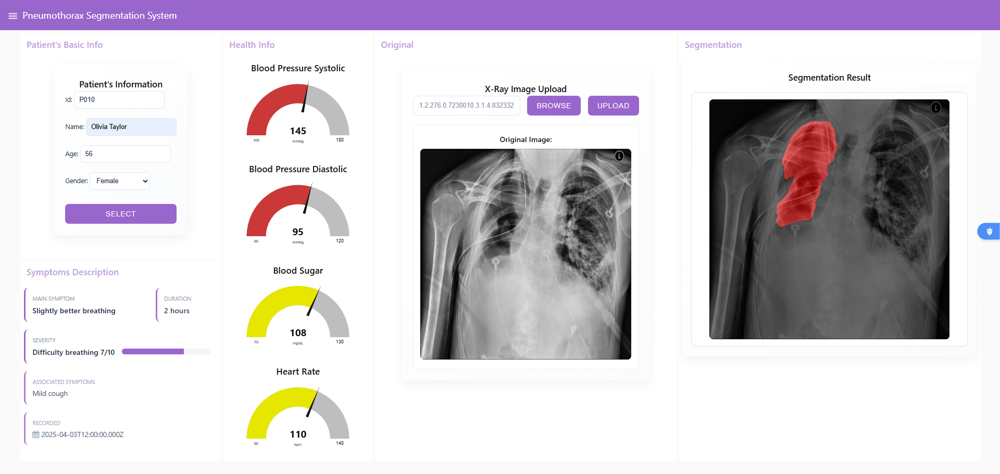

# PneSeg-Platform

---

## Overview
This project demonstrates a low-code approach to build a pneumothorax segmentation system using **Node-RED** for orchestrating workflows, a frontend for user interaction, a database for storing patients' conditions, and a backend Python API for processing medical imaging data.
(Patients' data is SIMULATED DATA, not real data.)

---

## Prerequisites
- **Node-RED**: Install Node-RED globally (`npm install -g node-red`) or run via Docker. 
- **Node.js**: Version 20.9.0 LTX.
- **Python**: Version 3.8+ for the backend API.
- **Database**: MarineDB 5.5.16 (configurable in Node-RED).
- **Frontend Dependencies**: Basic HTML/CSS/JavaScript setup.

---

## System Architecture
1. **Frontend**: A web interface built with HTML/JavaScript to upload X-ray images and display segmentation results.
2. **Node-RED**: Acts as the low-code orchestration layer, handling data flow between the frontend, database, and backend API.
3. **Backend API**: A Python-based API (using FastAPI) that processes X-ray images for pneumothorax segmentation.
4. **Database**: Stores patients' conditions.

---

## Setup Instructions

### 1. Node-RED Setup
- Install Node-RED: `npm install -g --unsafe-perm node-red`
- Start Node-RED: `node-red`
- Access the Node-RED editor at `http://localhost:1880`
- Install additional nodes:
  - `node-red-node-mysql`
- Create a flow:
  - **Download node_create.json**: Uploads json file at node-red editor.


### 2. Backend API Setup
- Install Python dependencies:
  ```bash
  pip install fastapi uvicorn opencv-python numpy
  pip install torch==2.4.0 torchvision==0.19.0 torchaudio==2.4.0 --index-url https://download.pytorch.org/whl/cu118
  ```
- Check a Python script (`python_api.py`) for the API:
  - Perform segmentation using a pre-trained model (e.g., U-Net or you can using your own model nad weights).
  - Return segmentation masks as JSON or image data.
- Example API endpoint:
  ```python
  from fastapi import FastAPI, File, UploadFile
  import cv2
  import numpy as np

  app = FastAPI()

  @app.post("/predict")
  async def predict(file: UploadFile = File(...)):
      image_bytes = await file.read()

      with torch.no_grad():
            output = model(input_tensor)
            mask_array = postprocess_mask(output)
      mask_pil = Image.fromarray(seg_mask)
      output_buffer = io.BytesIO()
      encoded_image = base64.b64encode(output_buffer.getvalue()).decode("utf-8")

      return {"image": f"data:image/png;base64,{encoded_image}"}      
  ```
- Run the API: `uvicorn app:app --host 0.0.0.0 --port 8000`


### 4. Database Setup
- **MarineDB**: Install and run MongoDB locally or use a cloud service.
- **MySQL**: Set up a table for storing patients' conditions.
- Configure Node-RED database nodes to connect to your database.

## Workflow
1. User uploads a X-ray image via the frontend.
2. Node-RED receives the image, forwards it to the Python API.
3. The Python API processes the image and returns a segmentation mask.
4. Node-RED stores the result in the local and sends it back to the frontend.
5. The frontend displays the segmentation mask overlaid on the original image.

---

## Running the Project
1. Start the Python API: `uvicorn app:app --host 0.0.0.0 --port 8000`
2. Start Node-RED: `node-red`
3. Open the frontend in a browser: `http://localhost:1880/ui`.
4. Upload a X-ray file and view the segmentation results.

---

## Notes
- Ensure the Python API has access to a trained segmentation model.
- Test with sample X-ray files from public datasets (e.g., SIIM-ACR Pneumothorax Segmentation).
- Secure API endpoints and database connections in production.

---

## Node-red Editor



---

## Demo Results

### login page



### main page



